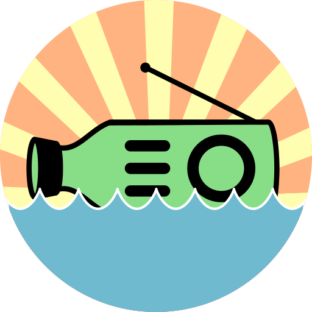

# Bottle Radio



**All in one application to run an automated radio station with the ability to live stream a performance.**

This is a service that contains a number of applications running as Docker containers to provide a cohesive experience that allows both amateurs and professionals to run a self hosted web radio station.

**Bottle Radio is currently in alpha**. This means things will be subject to change without notice, possibly introducing breaking changes. You should only proceed if you are comfortable with Docker and starting from scratch if needed.

- [Live Demo](#live-demo)
- [Background](#background)
- [Application structure](#application-structure)
- [Installation](#installation)
  - [Prerequisites](#prerequisites)
    - [DNS](#dns)
  - [Setup](#setup)
    - [Configuration](#configuration)
    - [Customisation](#customisation)
      - [Custom Links](#custom-links)
      - [Station Name](#station-name)
      - [Logo](#logo)
      - [Jingle](#jingle)
- [Usage](#usage)
  - [Listening](#listening)
  - [Automated playback with Spotify](#automated-playback-with-spotify)
  - [Streaming](#streaming)
- [Contribute](#contribute)

## Live Demo

See the real thing in action at [bottleradio.com](https://bottleradio.com).

## Background

I was looking in to the possibility to run a 24/7 web radio station and started investigating what was already available. I wanted the following features in the solution:

- Ability to play from Spotify when nothing else broadcasting
- Ability to have someone live stream a DJ set or a show from their computer
- Have the switch between the two modes be seamless, with a jingle in between

After struggling with applications like [AzuraCast](https://www.azuracast.com/) and [LibreTime](https://libretime.org/), I could not find something stable enough for what I wanted. AzuraCast had a lot of what I wanted, but the live streaming function rarely worked. With LibreTime, most functions worked but I found the scheduling too restrictive and the setup was a pain.

It was then I decided to use the best parts from these systems, and distill them in to a service with just the functionality I required.

## Application structure

The application consists of multiple Docker containers, managed by a single `docker-compose.yaml` file. These are:

- **[Traefik](https://containo.us/traefik/)** - a reverse proxy that manages the routes to all the containers and provides automatic HTTPS
- **[Mopidy](https://mopidy.com/)** - an extensible music server that is used to provide Spotify playback
- **[Liquidsoap](https://www.liquidsoap.info/)** - a scripting language that handles the switching between Spotfy and live broadcast streams
- **[Icecast](https://icecast.org/)** - a streaming server that sends the final stream to listeners
- **Frontend** - a React application built from the ground up to be a responsive player interface

## Installation

### Prerequisites

- _(for production use)_: a domain name where you can control DNS records
- Docker Engine _(tested on Ubuntu 18.04.1)_
- Port 80, 443 and 8005 forwarded to Docker host
- Spotify Premium account

#### DNS

For testing locally, a domain of `docker.localhost` will suffice.

For production, please set the following A records:

| Type | Name | IPv4 Address          |
| ---- | ---- | --------------------- |
| A    | `@`  | Docker Host public IP |
| A    | `*.` | Docker Host public IP |

### Setup

1. Clone this repo to your host
2. Change to the directory `bottle-radio`
3. Copy `.env-example` to `.env`
4. Alter the variables in `.env` as per below
5. Run `docker-compose up` and check for any errors _(may need to run with `sudo` depending on environment)_
6. The first run might take a while as it needs to build the image
7. If all looks OK, hit `CTRL+C` to kill, and then run `docker-compose up -d` to run it in the background

> Keep a backup of yout `.env` file as this is used to setup the application.

_Example:_

```bash
git clone https://github.com/MrLemur/bottle-radio.git
cd bottle-radio
cp .env-example .env
sudo docker-compose up
```

#### Configuration

**`.env` file values:**

| Field                     | Description                                                       | Example Value                        |
| ------------------------- | ----------------------------------------------------------------- | ------------------------------------ |
| `DOMAIN`                  | root domain of Docker host <sup>1</sup>                           | `example.com`                        |
| `LETSENCRYPT_EMAIL`       | email address incase of SSL certificate issues                    | `webmaster@example.com`              |
| `REACT_ICECAST_URL`       | stream + your root domain name in HTTPS URL                       | `https://stream.example.com/`        |
| `REACT_KEY`               | random number above 1 million                                     | `436587547365`                       |
| `LIQUIDSOAP_DJ_USERNAME`  | username to be used for live broadcasts                           | `broadcast-dj`                       |
| `LIQUIDSOAP_DJ_PASSWORD`  | password to be used for live broadcasts                           | `broadcast-password`                 |
| `ICECAST_SOURCE_PASSWORD` | icecast password for mopidy                                       | `mopidy-password`                    |
| `ICECAST_ADMIN_PASSWORD`  | icecast password for admin interface                              | `admin-password`                     |
| `ICECAST_PASSWORD`        | icecast password for other uses (not used)                        | `normal-password`                    |
| `ICECAST_RELAY_PASSWORD`  | icecast password for relaying (not used)                          | `relay-password`                     |
| `MOPIDY_AUTH`             | username/pasword in .htpasswd format <sup>2</sup>                 | `spotify-admin:576rdfD\$67gddvgskjs` |
| `SPOTIFY_USERNAME`        | Spotify premium username                                          | `example`                            |
| `SPOTIFY_PASSWORD`        | Spotify premium password                                          | `example-password`                   |
| `SPOTIFY_CLIENT_ID`       | [value from here](https://mopidy.com/ext/spotify/#authentication) | `687468-47843rh7f8`                  |
| `SPOTIFY_CLIENT_SECRET`   | [value from here](https://mopidy.com/ext/spotify/#authentication) | `bBYUBLYBh87B87G\$=`                 |

<sup>1</sup> Use `docker.localhost` when running locally

<sup>2</sup> Use [this site](https://hostingcanada.org/htpasswd-generator/) to generate the value using with bcrypt encryption

#### Customisation

> These changes will require the containers to be stopped and restarted.

##### Custom Links

Links to other pages can be added by editing the `frontend/src/links.json` file. This is a JSON list, with `display` being the link display text and `href` being the URL.

**Example:**

```json
[
  {
    "display": "This is an example link",
    "href": "https://example.com/"
  },
  {
    "display": "Homepage",
    "href": "https://myhomepage.com/"
  }
]
```

##### Station Name

There is currently no variable to set the station name in the `.env` file. In the meantime, you can do a search and replace for all files in the `frontend/` directory for `bottle radio` and you should be able to replace the appropriate values with your station name.

> Please leave the "Powered by Bottle Radio" link alone _(within `frontend/src/components/Container.jsx`)_ in order to redirect questions to this project.

##### Logo

Logos are currently in the `frontend/public/` directory. These are:

- `favicon.ico` - favourite icon that appears in the browser tab
- `logo192.png` - smaller version of main logo
- `logo512.png` - main logo used in frontend

These logos are used in multiple places (browser, offline app), so make sure they are the same dimensions as the existing ones and are the same logo, just resized. Circular logos work best.

##### Jingle

There is a jingle that will play when transitioning from the automated broadcast to a live stream, and vice versa. This can be found in `conf/jingle.mp3`. It works best if the jingle is between 9-14 seconds long.

## Usage

Follow the below steps after setup to get your station on air!

1. Go to `https://spotify.your.domain/`
2. Use the username/password you set for `MOPIDY_AUTH` variable
3. Click on `iris`
4. Find a playlist and hit the play Button
5. Go to `https://your.domain`
6. Click the play button
7. After 20-30 seconds, you should now hear the stream

### Listening

The frontend player interface will be available at `https://your.domain/`. This is what listeners will use.

The following features are available:

- currently playing artist and track tracks
- button to view streaming/buy links for the now playing tracks
- visualiser in time to the music player
- customised Links
- button to show HTML code to embed player in another site
- a little hidden something

### Automated playback with Spotify

This can be accessed at `https://spotify.your.domain/` and clicking on the `iris` link.

By using Mopidy, Spotify playback can be achieved when there is not a live stream in progress. The best way to ensure uninterrupted playback is to start a very long playlist (48+ hours), or multiple playlists queued. For best results, set the player to repeat and shuffle.

### Streaming

This application will accept input from any Icecast 2 compatible source client (Butt, Mixxx) without any configuration changes. Follow the steps below to start live streaming:

- Configure the host as `liquidsoap.your.domain`
- Set port as `8005`
- Set protocol to be `Icecast 2`
- Set the mount point to `/`.
- Set the username to what was configured in `LIQUIDSOAP_DJ_USERNAME`
- Set the password to what was configured in `LIQUIDSOAP_DJ_PASSWORD`
- Start broadcasting
- Once the connection time hits around 11 seconds, you will be live on air!
- This time until you are live can depend on jingle length and network latency. Experiment to see what works best!

## Contribute

This project is still in very early stages, so any contributions would be greatly appreciated!

You can raise a bug or feature request [here](https://github.com/MrLemur/bottle-radio/issues).

If you want to contribute code, please fork this repo and submit a PR!
